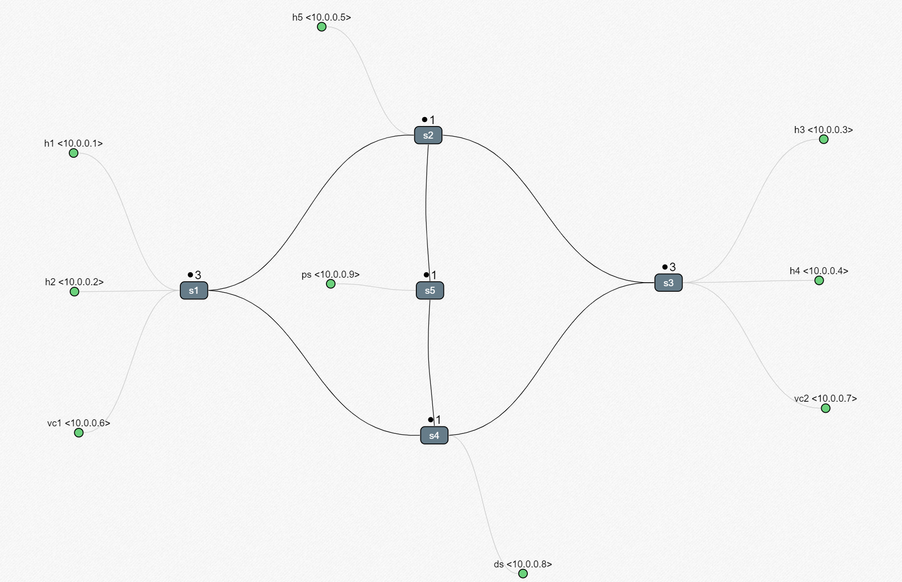
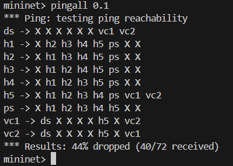
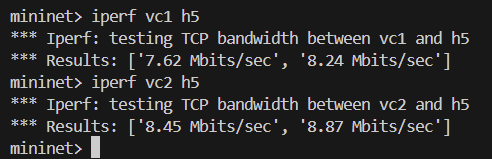
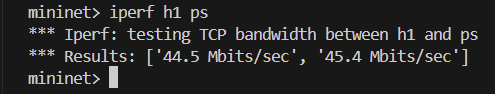
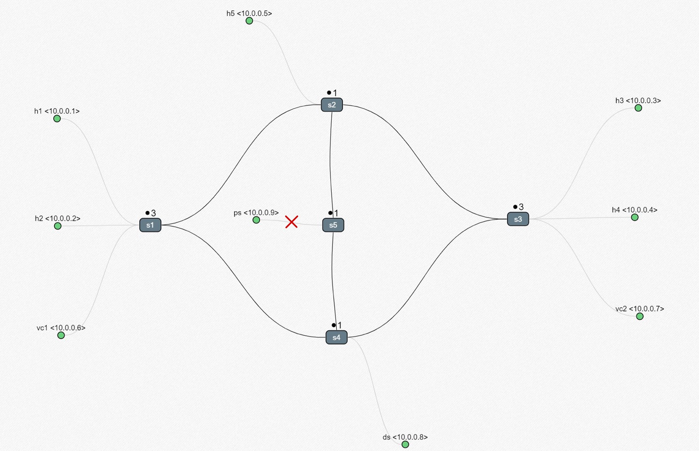
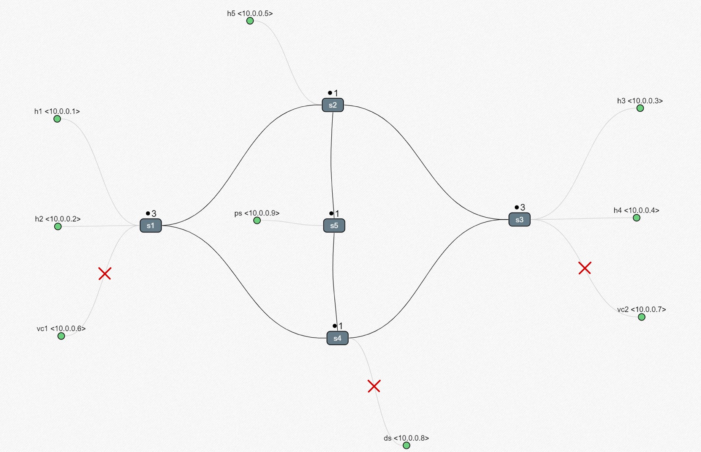

# Networking Slice Manager

## Overview
This project aims to develop a networking slice manager, facilitating the dynamic activation and deactivation of network slices via both a graphical user interface (GUI) and command-line interface (CLI), tailored to meet diverse network requirements. The implementation encompasses three operational modes: `Work`, `Conference`, and `Emergency`.

The network topology comprises:
- 1 Software-Defined Networking (SDN) controller (`c1`)
- 5 OpenFlow switches (`s1`, `s2`, `s3`, `s4`, `s5`)
- 9 Hosts (`h1`, `h2`, `h3`, `h4`, `h5`, `ps`, `vc1`, `vc2`, `ds`)

## Project Description

Depending on the selected mode the bandwidth is divided between the slices.

### 1. WORK MODE



#### TESTING WORK MODE:








### 2. CONFERENCE MODE




### 3. EMERGENCY MODE



## How to run
1. Connect with a comnetsemu portale or install all the functionalities in your system
2. Launch the controller  
```$ sudo ryu-manager controller.py```
3. Launch the GUI
```$ python3 gui.py```
4. Emulate the topology with mininet
```$ sudo python3 topology.py```
5. To verify that all the links are working execute 
```mininet> pingall 0.1```

```IMPORTANT! Remember to delete the topology when you exit mininet, through the commands```

```
mininet> exit
$ sudo mn -c
```
### Useful command 
```mininet> dpctl dump-flows``` -> Show all the switches flows

```mininet> h1 ping h2``` (It also works with other hosts) 

```mininet> iperf h1 h2``` -> Verify the bandwidth of the linkage between two hosts (It also works with other hosts)

```mininet> net``` -> Shows all the hosts

```mininet> ports``` -> Shows all switches and their linkage with the hosts


## Presentation
[Project presentations](https://www.canva.com/design/DAGFIgibN2U/WlXBTW6tYIre0Jk1B_K65Q/edit?utm_content=DAGFIgibN2U&utm_campaign=designshare&utm_medium=link2&utm_source=sharebutton)

Students: [Aarif Usama](https://github.com/JynoX) - [Milena Sonda](https://github.com/mileunitn)


